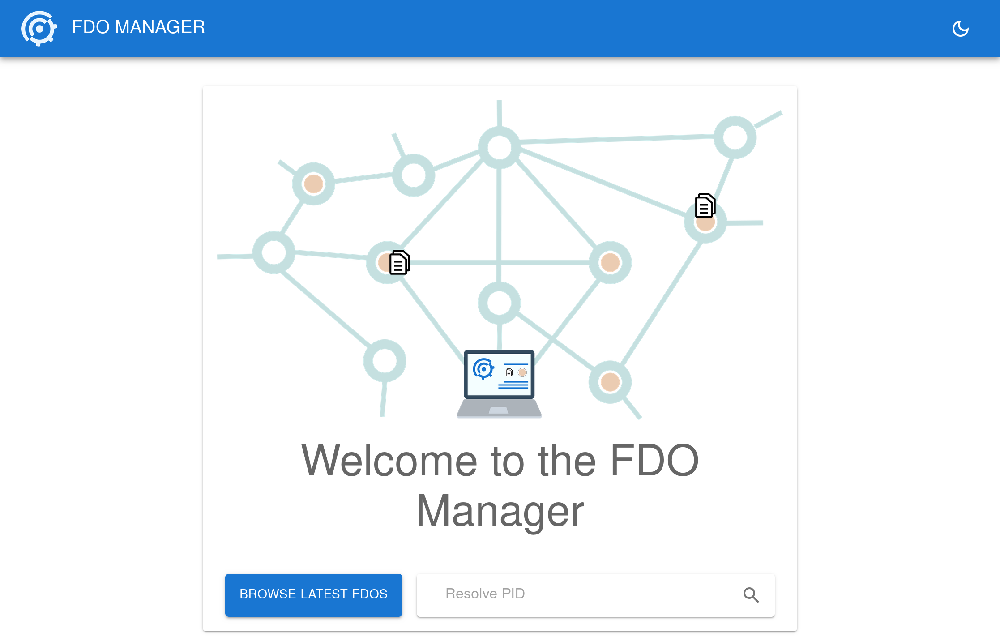
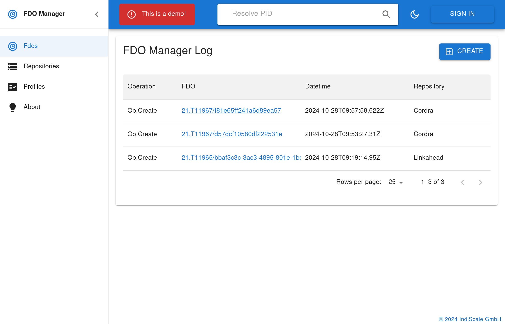
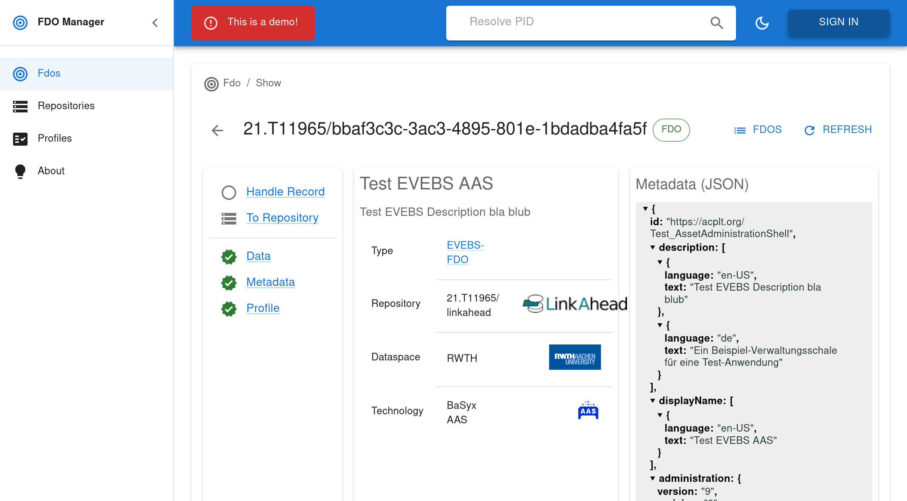
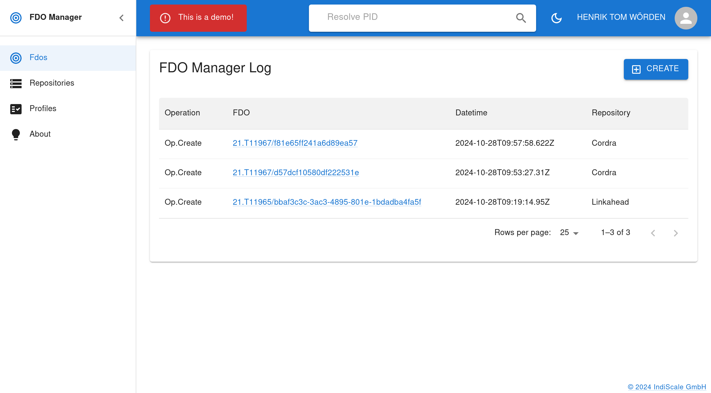
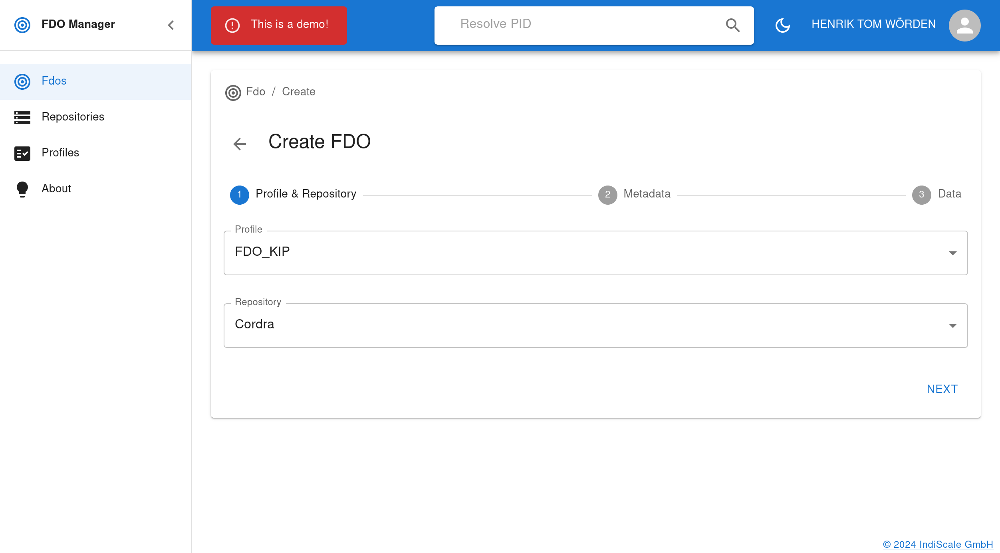
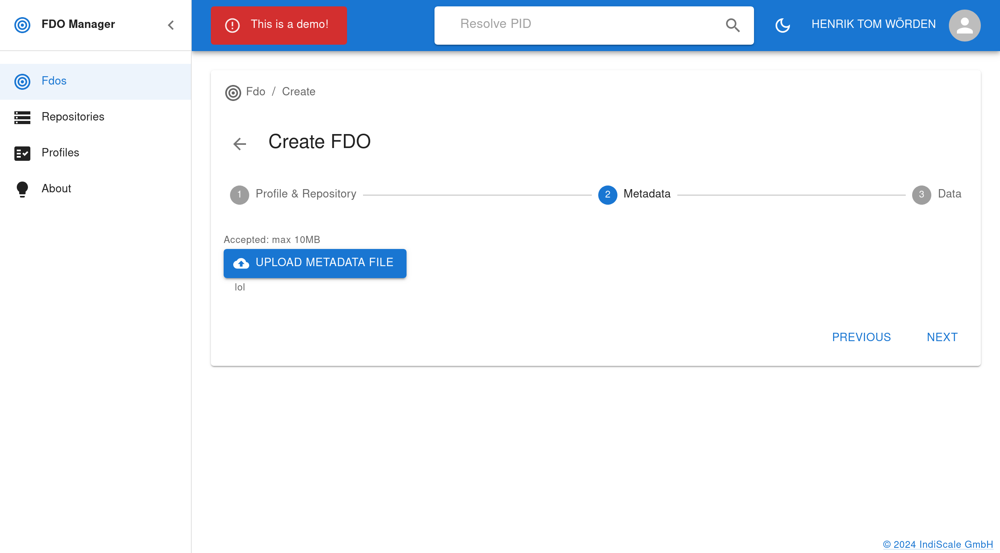
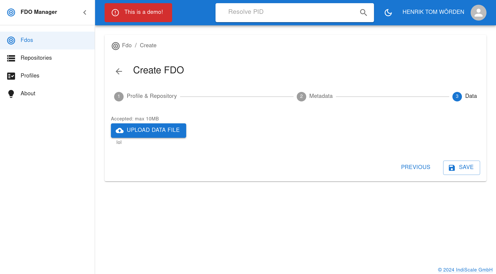
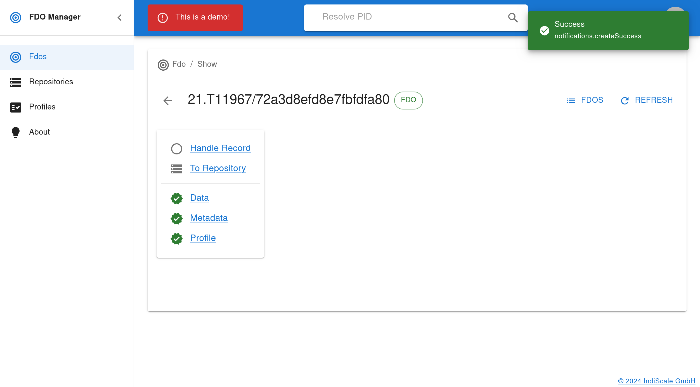

# FDO One Testbed Tutorial

In this tutorial we given an introduction to the FDO testbed that was created
in the FDO One project. We provide and component overview and illustrate some
activities that can be done with the testbed.

This does not include a comprehensive documentation on every aspect of the
[project](https://fdo-one.org/), components of the testbed or 
[concepts of FDOs](https://fairdo.org).

We will first focus on the publicly available testbed and describe how you can
setup a local testbed on your computer below.

## Component overview

### Handle system
An essential ingredient for FDOs are the PIDs. In the FDO One project, we use
handles as PIDs which are composed like this: `<prefix>/<postfix>`.
A public handle service is provided by [CNRI](https://www.cnri.reston.va.us/):
[here](https://hdl.handle.net/).

### LinkAhead
LinkAhead is a research data management system that serves in this testbed as
one DOIP capable data repository. We will use DOIP to upload data (DOs) to LinkAhead
and LinkAhead will create PID records for each DO. You can visit the LinkAhead
instance of the public testbed [here](https://linkahead.testbed.pid.gwdg.de/).

### Cordra
Cordra is the second DOIP capable repository and serves the same purpose as
LinkAhead. You can access it [here](https://cordra.testbed.pid.gwdg.de/#)

### FDO Manager
The testbed includes the FDO Manager Service, a web service that allows to
create FDOs. The service translates the given data and metadata into multiple
DOIP calls to one of the data repositories such that PID records are created to
compose an FDO as it was defined in the FDO One project.

The testbed also includes a web frontend for this service, where user can
create FDOS using a [graphical interface](https://manager.testbed.pid.gwdg.de).

### AAS Server
The asset administration shell is an industry standard for digital twins. We
deployed an AAS server in the testbed and created FDOs for shells that are
served by the server. The server has no grafical frontend, however you can
explore the data via its [endpoint](http://aas.testbed.pid.gwdg.de).

### EDC Connector
We use EDC as an example technology which allows to build data spaces. In EDC
data spaces, data exchange occurs from one connector to another. Each connector
has a catalog that contains information on the assets that the connector
provides. We will create FDOs for every asset in an EDC connector that is
marked accordingly. You can only interact with the connector, if you are part
of the same data space. Thus you can only see the results / the FDOs in the
testbed but you cannot access the connector itself. 

## Creating an FDO using the Manager
The simplest way to create an FDO is to visit the
[FDO Manager](https://manager.testbed.pid.gwdg.de). 

Click on "Browse latest
FDOs" or enter the PID of an FDO in "Resolve PID". 

You can have a look at the
FDO representation in the FDO Manager and jump to the different components of
the testbed using the links.

In order to create new FDO in the FDO One testbed, you first need to login.
The testbed uses and authentication service provided by the GWDG: the academic
cloud. You can register for trying out the testbed.

Once you are logged in, you can click the section "Fdos" on the left and then 
the "Create" button on the top right. You will be asked to upload data and
metadata. Note, that whatever you upload will be publicly available afterwards.
After you completed the creation, you are presented with the newly created FDO
that is identified by the PID which is shown as heading. The following images
show this process:

Since we created a very generic FDO in this process, the representation is very
simple and simply provides you with a couple of links that let you
- inspect the handle record to which the FDO PID points
- jump to the repository in which the FDO was created
- jump to data, metadata or the profile that was used.

Thus the creation process led to the upload of the
data and the metadata file into the selected data repository. Also, three
PID records were created that together make up the FDO. The PID records
corresponding to the data and metadata are referenced by the one that you can
reach from the web interface. 
Thus, the FDO was correctly created and
this is depicted in the webinterface by the green check marks and the green FDO
icon.

Let's see how this can look like if we create FDOs that use more specific types
and profiles in the following section.

## FDOs created by the AAS server
The testbed contains an AAS server that hosts a demonstration shell.
The corresponding FDO is created automatically and you can find it [here](
https://manager.testbed.pid.gwdg.de/fdo/show/21.T11965/bbaf3c3c-3ac3-4895-801e-1bdadba4fa5f)
As you can see, we can see here additional information:
- the FDO Type is shown
- The FDO has a name that is used as title and 
- a description that is used as subtitle.

These illustrate two things: 
1. The FDO Type tells us what kind of digital object we are looking at.
2. The metadata is machine actionable: title and description are taken from the
   FDO metadata (provided as JSON and shown at the side) using a given
   vocabulary ("description" and "displayName")

If you click on "Data" you will be forwarded to the endpoint of the AAS server
that serves the shell and the browser will show you a JSON representation of 
the shell.

## FDOs representing data space assets
In order to show case how the same kind of data objects can be added to the FDO
framework from different kinds of data storage solutions / data providers, we 
created an FDO for an ASS that is provided by an EDC connector: a demonstration
dataset created with a connector of the Mobility Data Space (MDS).

[Have a look!](https://manager.testbed.pid.gwdg.de/fdo/show/21.T11967/1c7d3f74259406563ab3)

As you can see, the FDO has the same type as above. If you click on the "Data" 
link, you will see that only the endpoint URL of the connector is given and not
the data. In order to retrieve the data a normal EDC data space connection has
to built up to the data provider connection.

## Summary
In this tutorial, you
1. create an FDO by uploading data and metadata to a data repository
2. examined an FDO for a shell provided by an AAS server
3. examined an FDO for an asset in an EDC data space that provides information about
   the asset and connect the EDC data space to the FDO network without
   compromising the data space sovereignty 

If you would like to experiment with the tools created in the FDO One project
further, you can follow the following tutorial and create a testbed on your
local machine. This allows you to interact with the AAS server and the EDC
connector yourself.

# FDO One Local Testbed Tutorial

With the local testbed of the FDO One project, you can run all components of
the testbed on your local machine using [Docker](www.docker.com). Docker is a
containerization technology that allows you to deploy complex components on you
machine in an easy fashion. If you are not familiar with Docker, please get
accustumed to it first, before you try any of the following steps.

## Component overview
The components are basically the same as in the public testbed. With the
following exceptions.

### Handle system
The testbed includes a local handle system with preconfigured
prefixes (`TEST` and `TEST.CORDRA`).

## Starting the testbed
Please consult the [README](./README.md) to learn how to start the testbed.

## Creating FDOs using the FDO Manager
You can use the FDO Manager in your local testbed in the same way as it was 
described above.

## Creating FDOs for shells in an AAS server
The AAS server creates an FDO for the shell that it contains by default by
using the API of the FDO Manager service. Have a look at the description of
this FDO in the [FDO Manager Webui](http://localhost:8000/). The FDO that was 
created for the shell is listed directly after starting the testbed when you
click "Browse latest FDOs" on the start page.
Note, that here, the data remains in teh AAS server and is *not* copied to the
data repository. It is only a short description of the AAS that is  uploaded.

You can access the API of the AAS server in order to create new shells: 
http://localhost:9080/api/v3.0/shells/
See [basyxs documentation](https://github.com/rwth-iat/aas-python-http-client/)
for information on how you can interact with the API.

For every newly added shell, there will automatically an FDO be created. As
before you may look at those using the FDO Manager in the "Fdos" tab.

## Creating FDOs for assets of an EDC connector
First you need to run the EDC connector. We will use the MDS connector in this 
tutorial. You find documentation on how to run the connector
[here](https://github.com/Mobility-Data-Space/mobility-data-space/wiki/Get-the-MDS-connector#on-premise-installation). Once you have the connector running, you can use the FDO-EDC-Adapter to 
publish data sets that are registered in the connector. You need the
[corresponding
repository](https://gitlab.com/fairdo/fdo-edc-adapter/fdo-from-catalogue).
Follow the instructions in the `README.md` on how to configure the adapter.
After the configuration you can run the adapter as detailed in the `README`
file and the adapter will create FDOs for all assets in the connector that are
marked with the special "isFDO" attribute. The adapter will print the FDO PIDs
and the PIDs will also be written to the assets in the connector. 
When you visit [the FDO Manager Webinterface](http://localhost:8000/) you can
resolve those PIDs to have a look at the FDOs.

## Summary 
In this tutorial, you
1. created an FDO by uploading data and metadata to a data repository
2. created FDOs for shells in an AAS server that connect the AAS server to the
   FDO network without copying/uploading the data itself
3. create FDOS for asset in an EDC data space that provide information about
   those assets and connect the EDC data space to the FDO network without
   compromising the data space sovereignty 
