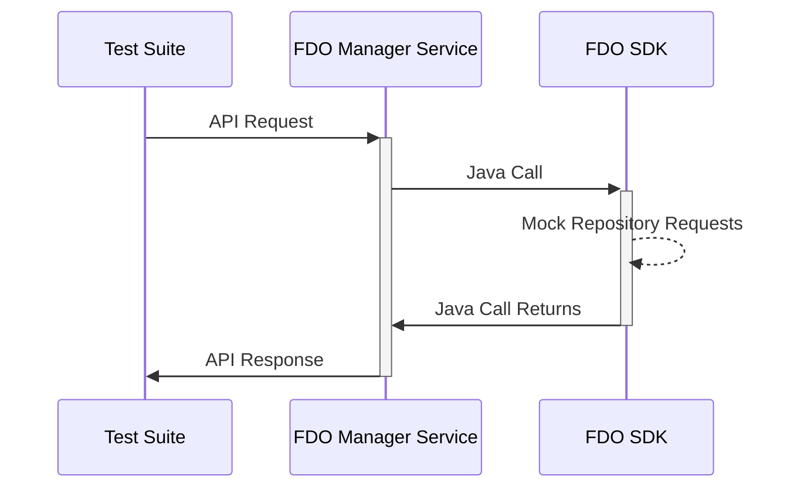
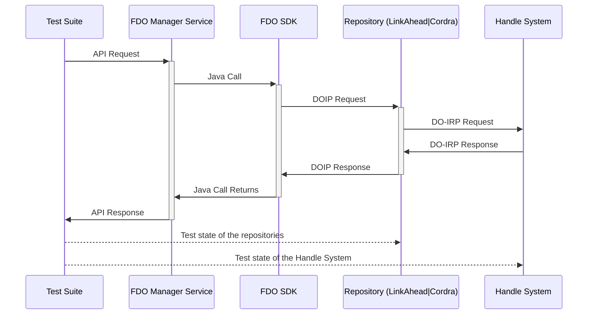

# FDO Manager End-to-end Tests

This repository contains a python test suite for testing the FDO Manager using [pytest](https://docs.pytest.org/en/stable/getting-started.html).

## Mockup Mode

The test suite send requests via the REST API to the FDO Manager Service which then delegates the call to the FDO SDK. When the FDO Manager Service runs in mockup mode the testing covers the following components:



## Full End-to-end Testing

When the FDO Manager Service is configure to use actual repositories the tests cover the full path of requests and also checks the effects on the repositories and the handle system independently from the FDO Manager API.



## Run Tests

### Installation and Testbed Setup

To run the tests, the [python client](https://gitlab.indiscale.com/fdo/fdo-manager-clients/-/tree/main/example-client?ref_type=heads)
must be installed, which can be done by running `install_python_client.sh`.
Afterwards, all dependencies from requirements.txt can be installed with

```
pip install -r requirements.txt
```
To set which services are tested, modify `manager_test/service_index.py`. By
default, the test suite is set up to run against a local testbed. You need to
start the local testbed by

```
make -C fdo-local-testbed clean start
```

### Start Tests

⠀\
Then all tests can be run from this directory using
```
 pytest --order-dependencies  --ignore-unknown-dependency
```
⠀\

### Teardown Local Testbed
Stop the local testbed afterwards with

```
make -C fdo-local-testbed stop
```


#### Usage of `install_python_client.sh`

The api.yaml that the `install_python_client.sh` shell script generates a
client for can be changed by setting one of two environment variables: \
`API_CLIENT_PATH` for a file path or `API_CLIENT_URL` for an url. \
If both are set, `API_CLIENT_PATH` is used.

### Troubleshooting

If pytest is not a recognized command, the pytest.py location may not be
available in PATH. To solve this error, find out where the pytest script was
installed on your PC and append the value to your PATH environment variable.
